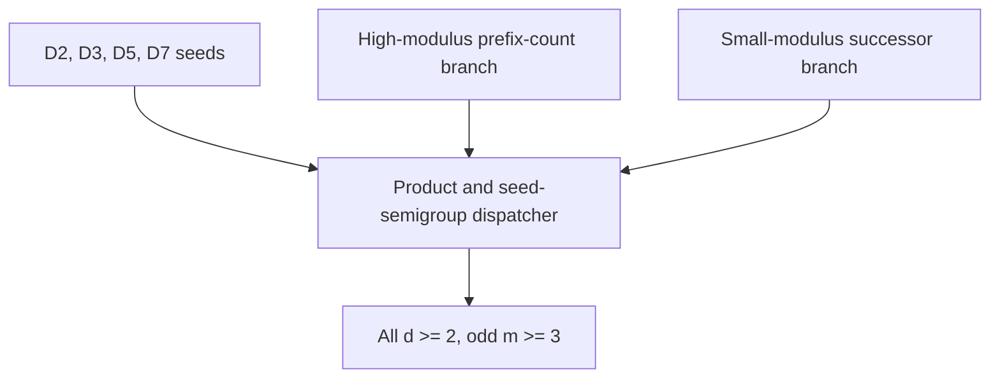
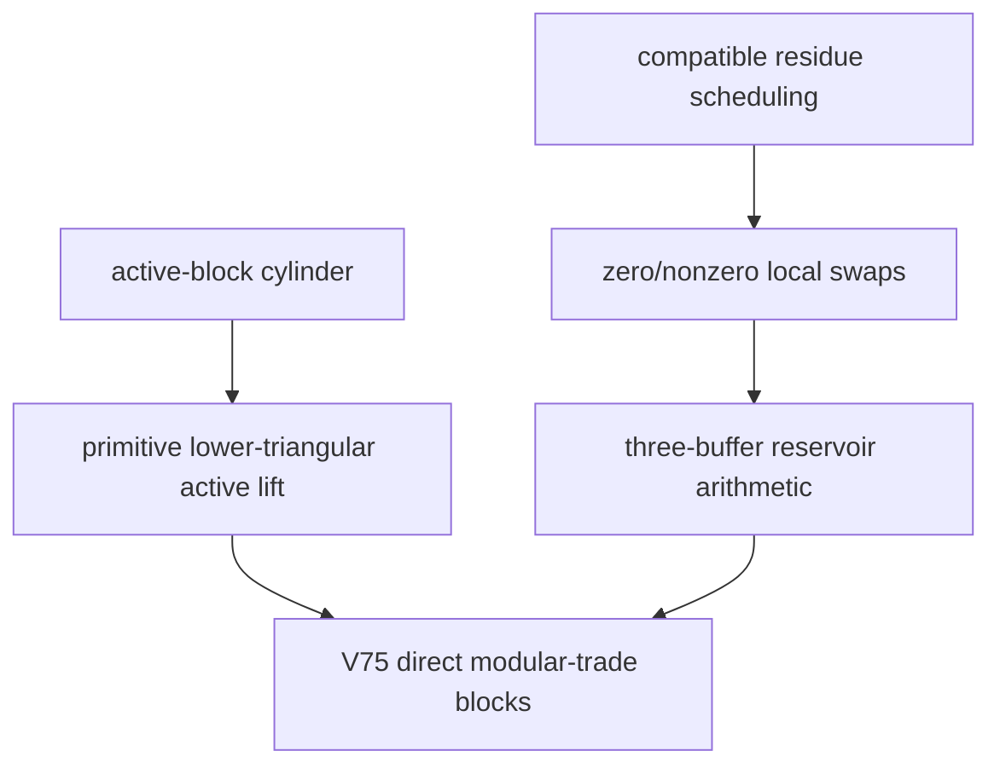

# Torus Hamilton Decomposition Program

Lean 4 formalization workspace for Hamilton decompositions of directed
odd-modulus torus Cayley digraphs.

The main target is the directed basis Cayley digraph

```text
Cay((ZMod m)^d, {e_0, ..., e_{d-1}})
```

and the goal is to prove that, for every `d >= 2` and every odd `m >= 3`,
its arcs decompose into `d` directed Hamilton cycles.

This repository is also a proof-audit workspace.  Some modules are finished
theorem libraries, while the newest `RoundComposite` files expose the current
paper-facing endpoint cuts for the all-dimensional theorem.

## Current Status

Snapshot: 2026-05-06.

Latest stable release:
[`0.0.3-allodd`](https://github.com/aria1th/Torus-Hamilton-Decomposition-Program/releases/tag/0.0.3-allodd).

```text
All odd m, all d >= 2
│
├─ finite seeds
│  ├─ d = 2                               [done]
│  ├─ d = 3                               [done]
│  ├─ d = 5                               [done]
│  └─ d = 7                               [done]
│
├─ high-modulus branch, m >= d
│  ├─ prefix-count/root-flat machinery     [done]
│  ├─ q >= 2 signed binary trellis core    [done]
│  ├─ half-slack/support bridge            [done]
│  └─ high-modulus endpoint adapters       [done]
│
├─ closure/dispatcher layer
│  ├─ product/composite closure            [done]
│  ├─ seed-semigroup arithmetic            [done]
│  └─ all-dimension wrappers               [done]
│
└─ small-modulus successor branch, m < d
   ├─ active-block cylinder construction   [done]
   ├─ primitive active-prefix lift          [done]
   ├─ local swap/residue algebra            [done]
   ├─ reservoir quota matching              [done]
   └─ canonical reservoir construction      [done]
```

The current V75 endpoint is closed in Lean:

```lean
RoundComposite.Concrete.odd_modulus_tori_all_dimensions_v75
RoundComposite.Concrete.oddModulusToriAllDimensionsGoal_v75
```

Cleanup work now focuses on reducing obsolete route noise, synchronizing the
paper-facing theorem names, and keeping historical branches clearly separated
from the current proof path.

## Proof Map

The repository currently organizes the proof into two large branches.



The current V75 small-modulus route is more explicit than the older abstract
finite-Hall route:



## Main Lean Endpoints

Seed endpoints:

```lean
Shared.D2.shared_cayley_uniform
Shared.D3.shared_cayley_uniform
D5Odd.D5_odd_cayley_unconditional
D7Odd.D7_odd_cayley_unconditional
```

All-dimensional endpoint shape:

```lean
RoundComposite.Concrete.OddModulusToriAllDimensionsGoal
```

Current paper-facing V75 adapters:

```lean
RoundComposite.Concrete.odd_modulus_tori_all_dimensions_v75
RoundComposite.Concrete.oddModulusToriAllDimensionsGoal_v75
RoundComposite.Concrete.odd_modulus_tori_all_dimensions_of_v75_directModularTrade_blocks
RoundComposite.Concrete.oddModulusToriAllDimensionsGoal_of_v75_directModularTrade_blocks
RoundComposite.Concrete.oddModulusToriAllDimensionsGoal_of_v75_directModularTrade_inputs
```

The final reservoir construction interface closed by the V75 route:

```lean
RoundComposite.BaseTail.Trades.SuccessorActiveBlockCanonicalNonzeroZeroReservoirArithmeticGoal
```

## Leftover Lean Theorem Targets

The all-odd endpoint is closed, but the current proof exposes two reusable
general theorems that should be separated and formalized as standalone
certificate-calculus components.

### 1. Local-symbol trade span

This is the linear algebra behind the active modular-trade step in Section 9 of
the manuscript.

Setup:

```text
R = ZMod m
C = finite color set
S = finite symbol set with a base symbol 0
X = finite set of base sites
A(x) ⊆ C = active colors at x
```

The co-active graph has vertex set `C` and an edge `{c,c'}` whenever some
`x : X` has `c,c' ∈ A(x)`.  For each co-active pair and each nonzero symbol
`τ`, the elementary local swap contributes

```text
(e_c - e_c') ⊗ (e_τ - e_0)
```

to the residue matrix in `R^(C × S)`.

Target theorem:

```text
If the co-active graph is connected, then the span of these local-symbol
trades is exactly the subspace of matrices with every row sum zero and every
column sum zero.
```

Componentwise variant:

```text
If the co-active graph has connected components K, then the image consists
exactly of matrices M satisfying:

  row sums:              ∑_σ M(c,σ) = 0        for every c
  component column sums: ∑_{c∈K} M(c,σ) = 0    for every component K and symbol σ.
```

Proof sketch to formalize:

```text
1. Each generator has zero row sums and zero column sums.
2. In a connected component, choose a root color c_*.
3. Any zero-row/zero-column matrix expands as

     M = ∑_{c≠c_*, τ≠0} M(c,τ)
           (e_c - e_c_*) ⊗ (e_τ - e_0).

4. A path c = c_0, ..., c_l = c_* in the co-active graph telescopes

     ∑_i (e_{c_i} - e_{c_{i+1}}) ⊗ (e_τ - e_0)
       = (e_c - e_c_*) ⊗ (e_τ - e_0).

5. Apply the same argument componentwise for the disconnected case.
```

Suggested Lean location:

```text
RoundComposite/BaseTailTrades.lean
```

Suggested endpoint names:

```lean
RoundComposite.BaseTail.Trades.localSymbolTradeSpan_connected
RoundComposite.BaseTail.Trades.localSymbolTradeSpan_components
```

### 2. Cyclic-layered/root-flat certificate soundness

This abstracts Theorem 2.2 of the manuscript away from equal-side tori.  It is
the proof that a primitive local-Latin root-flat certificate is already enough
to produce a Hamilton decomposition.

Group-free cyclic-layered version:

```text
V = ZMod m × K
Λ = finite label set
C = finite color set, |C| = |Λ|

For each layer t and label λ, a directed labeled arc map is

  (t,u) ↦ (t+1, F(t,λ,u)).

A certificate is δ(t,u,c) ∈ Λ.
```

Target theorem:

```text
Assume:

1. Local Latin:
   for every (t,u), c ↦ δ(t,u,c) is a bijection C ≃ Λ.

2. Primitive return:
   for each color c, define P_t,c(u) = F(t, δ(t,u,c), u).
   The return map

     R_c = P_{m-1,c} ∘ ... ∘ P_{0,c}

   is a single cycle on K.

Then the colored labeled arcs form a Hamilton decomposition of ZMod m × K.
```

Key proof point:

```text
Since R_c is a single cycle, it is bijective.  On a finite set, if a product
P_{m-1} ... P_0 is bijective, then each factor P_t is bijective.  Therefore the
full color map T_c(t,u) = (t+1, P_t,c(u)) is a permutation.  Its m-step return
on layer 0 is R_c, so T_c is a single cycle on all m|K| vertices.
```

Height-one abelian Cayley specialization:

```text
G finite abelian
Ω = labeled generator multiset
χ : G → ZMod m with χ(ω) = 1 for every generator ω
K = ker χ

Choose representatives r_t with χ(r_t)=t.  Then

  q(t,ω) = r_t + ω - r_{t+1} ∈ K

and each Cayley step is

  (t,k) ↦ (t+1, k + q(t,ω)).
```

Target theorem:

```text
For any finite height-one abelian Cayley digraph, a local-Latin root-flat
certificate whose color returns are single cycles on ker χ yields a Hamilton
decomposition of the labeled Cayley digraph.
```

Suggested Lean locations:

```text
Shared/RootFlat.lean
Shared/CyclicLayered.lean        (new file, if the group-free theorem is split out)
```

Suggested endpoint names:

```lean
Shared.cyclicLayeredHamiltonDecomposition_of_localLatinReturn
Shared.heightOneCayleyHamiltonDecomposition_of_rootFlatCertificate
```

## Repository Layout

```text
Shared/
  Common Cayley decomposition interfaces, root-flat lifts, rank-cycle tools,
  and the D2/D3 shared seed adapters.

TorusD3Odd/
  Direct D3 odd formalization used by Shared/D3Seed.lean.

D5Odd/
  Odd D5 construction and Cayley wrapper.  Some even-modulus/Route-E files are
  retained as related work but are not the current all-odd main path.

D7Odd/
  Odd D7 construction, including handoff and bridge modules.

RoundComposite/
  All-dimensional proof architecture:
  prefix-count branch, seed semigroup, small-modulus successor branch,
  base-tail geometry, modular trades, and final concrete endpoints.

docs/
  Current research notes and paper/Lean synchronization documents.

scripts/
  Verification and audit scripts used during development.

certs/
  Finite certificates and related data.
```

The most useful files for orienting the current all-odd proof are:

```text
RoundComposite/ConcreteEndpoints.lean
RoundComposite/V75Endpoints.lean
RoundComposite/BaseTailTrades.lean
RoundComposite/BaseTailGeometry.lean
RoundComposite/PrefixCountHalfSlack.lean
RoundComposite/FiniteHoffman/SignedTrellis.lean
docs/ODD_TORI_V75_DIRECT_MODULAR_TRADE_GOAL_20260505.md
docs/ODD_TORI_RELEASE_CLEANUP_AND_PAPER_SYNC_20260506.md
```

## Build

This project uses Lean 4 with mathlib through Lake.

```bash
lake build RoundComposite.V75Endpoints
```

Useful focused checks:

```bash
lake env lean Shared/D3Seed.lean
lake env lean RoundComposite/BaseTailTrades.lean
lake env lean RoundComposite/V75Endpoints.lean
lake build RoundComposite.BaseTailTrades
lake build RoundComposite.V75Endpoints
```

The `lakefile.toml` currently pins mathlib at:

```text
leanprover-community/mathlib v4.30.0-rc2
```

## Reading Guide

For the mathematical story, start with the latest manuscript bundle and the V75
goal note in `docs/`.  For Lean work, start from
`RoundComposite/V75Endpoints.lean` and follow the hypotheses downward.

Recommended order:

```text
1. RoundComposite/ConcreteEndpoints.lean
2. RoundComposite/V75Endpoints.lean
3. RoundComposite/BaseTailTrades.lean
4. RoundComposite/BaseTailGeometry.lean
5. RoundComposite/PrefixCountHalfSlack.lean
6. RoundComposite/FiniteHoffman/SignedTrellis.lean
```

## Development Notes

- The root README is intentionally short.  Historical handoff details live in
  `docs/` or in module comments.
- The current main route is the V75 direct modular-trade route, not the older
  abstract de Werra/Hall endpoint.
- Avoid treating every `*Goal : Prop` as an unfinished theorem.  Many are
  named interfaces or adapters used to keep the proof graph readable.
- The active cleanup task is to keep obsolete branches quarantined, preserve
  reusable certificate-calculus components, and synchronize the manuscript with
  the closed V75 endpoint.
- Release tag links should be updated only after a matching GitHub release is
  created; until then, the README keeps the latest public stable tag.

## AI Disclosure

This formalization project used autonomous AI assistance during proof planning,
Lean implementation, code review, documentation, and audit work.  In particular,
OpenAI Codex 5.5 with `xhigh` reasoning and OpenAI GPT-5.5 Pro with `xhigh`
reasoning were used as autonomous formalization assistants.

The mathematical statements, proof strategy, accepted code changes, and final
repository contents remain subject to human review and responsibility.

## Citation

See `CITATION.cff` for citation metadata.  The manuscript and formalization are
still under active development.
