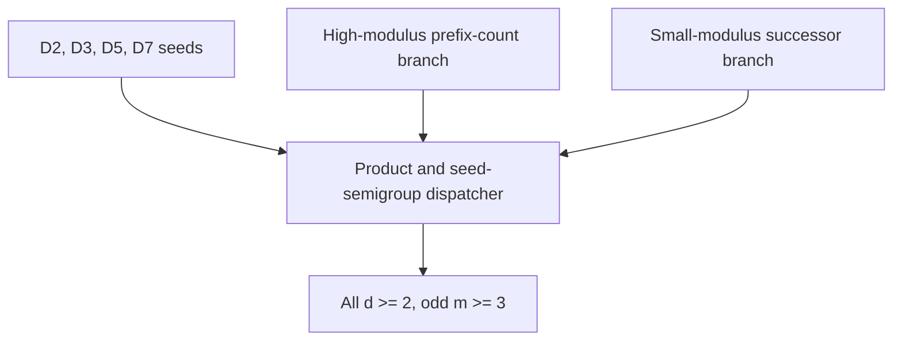
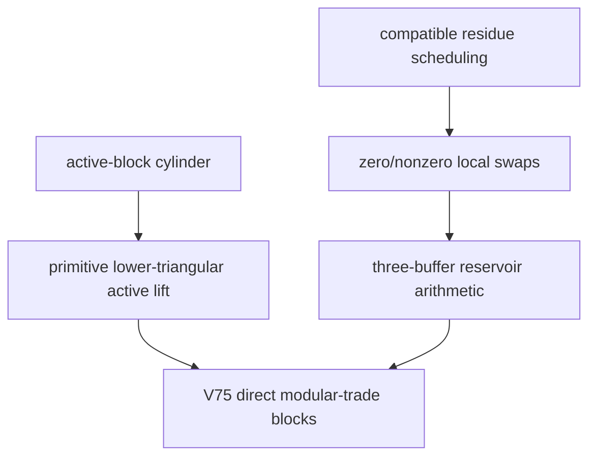

# Torus Hamilton Decomposition Program

Lean 4 formalization workspace for Hamilton decompositions of directed
odd-modulus torus Cayley digraphs.

The main target is the directed basis Cayley digraph

```text
Cay((ZMod m)^d, {e_0, ..., e_{d-1}})
```

and the goal is to prove that, for every `d >= 2` and every odd `m >= 3`,
its arcs decompose into `d` directed Hamilton cycles.

This repository is also a proof-audit workspace.  Some modules are finished
theorem libraries, while the newest `RoundComposite` files expose the current
paper-facing endpoint cuts for the all-dimensional theorem.

## Current Status

Snapshot: 2026-05-06.

Latest stable release:
[`0.0.3-allodd`](https://github.com/aria1th/Torus-Hamilton-Decomposition-Program/releases/tag/0.0.3-allodd).

```text
All odd m, all d >= 2
│
├─ finite seeds
│  ├─ d = 2                               [done]
│  ├─ d = 3                               [done]
│  ├─ d = 5                               [done]
│  └─ d = 7                               [done]
│
├─ high-modulus branch, m >= d
│  ├─ prefix-count/root-flat machinery     [done]
│  ├─ q >= 2 signed binary trellis core    [done]
│  ├─ half-slack/support bridge            [done]
│  └─ high-modulus endpoint adapters       [done]
│
├─ closure/dispatcher layer
│  ├─ product/composite closure            [done]
│  ├─ seed-semigroup arithmetic            [done]
│  └─ all-dimension wrappers               [done]
│
└─ small-modulus successor branch, m < d
   ├─ active-block cylinder construction   [done]
   ├─ primitive active-prefix lift          [done]
   ├─ local swap/residue algebra            [done]
   ├─ reservoir quota matching              [done]
   └─ canonical reservoir construction      [done]
```

The current V75 endpoint is closed in Lean:

```lean
RoundComposite.Concrete.odd_modulus_tori_all_dimensions_v75
RoundComposite.Concrete.oddModulusToriAllDimensionsGoal_v75
```

Cleanup work now focuses on reducing obsolete route noise, synchronizing the
paper-facing theorem names, and keeping historical branches clearly separated
from the current proof path.

## Proof Map

The repository currently organizes the proof into two large branches.



The current V75 small-modulus route is more explicit than the older abstract
finite-Hall route:



## Main Lean Endpoints

Seed endpoints:

```lean
Shared.D2.shared_cayley_uniform
Shared.D3.shared_cayley_uniform
D5Odd.D5_odd_shared_cayley_uniform
D7Odd.D7_odd_shared_cayley_uniform
```

All-dimensional endpoint shape:

```lean
RoundComposite.Concrete.OddModulusToriAllDimensionsGoal
```

Current paper-facing V75 adapters:

```lean
RoundComposite.Concrete.odd_modulus_tori_all_dimensions_v75
RoundComposite.Concrete.oddModulusToriAllDimensionsGoal_v75
RoundComposite.Concrete.odd_modulus_tori_all_dimensions_of_v75_directModularTrade_blocks
RoundComposite.Concrete.oddModulusToriAllDimensionsGoal_of_v75_directModularTrade_blocks
RoundComposite.Concrete.oddModulusToriAllDimensionsGoal_of_v75_directModularTrade_inputs
```

The final reservoir construction interface closed by the V75 route:

```lean
RoundComposite.BaseTail.Trades.SuccessorActiveBlockCanonicalNonzeroZeroReservoirArithmeticGoal
```

## Formalization Audit

The `0.0.3-allodd` release was audited on the pinned toolchain
`leanprover/lean4:v4.30.0-rc2` with mathlib revision
`5450b53e5ddc75d46418fabb605edbf36bd0beb6`.

The main endpoint has the following Lean type:

```lean
RoundComposite.Concrete.odd_modulus_tori_all_dimensions_v75
  {d m : Nat} (hd2 : 2 ≤ d) (hmodd : Odd m) (hm3 : 3 ≤ m) :
  Shared.CayleyHamiltonDecomposition d m
```

Here

```lean
Shared.TorusVertex d m := Fin d → ZMod m
Shared.torusBasis d m i := e_i
Shared.CayleyHamiltonDecomposition d m :=
  Nonempty (Shared.CayleyDecomposition d m)
```

and a `Shared.CayleyDecomposition` consists of a color-to-direction selector,
the local edge-partition/Latin condition, and the assertion that each colored
Cayley step is a single cycle.  Thus the endpoint is the formal statement that
the directed basis Cayley torus `Cay((ZMod m)^d, {e_0, ..., e_{d-1}})` has a
Hamilton decomposition for every `d >= 2` and every odd `m >= 3`.

The seed endpoints used by the final dispatcher check as:

```lean
Shared.D2.shared_cayley_uniform :
  ∀ {m : Nat}, 3 ≤ m → Odd m → Shared.CayleyHamiltonDecomposition 2 m

Shared.D3.shared_cayley_uniform :
  ∀ {m : Nat}, 3 ≤ m → Odd m → Shared.CayleyHamiltonDecomposition 3 m

D5Odd.D5_odd_shared_cayley_uniform :
  ∀ {m : Nat}, 3 ≤ m → Odd m → Shared.CayleyHamiltonDecomposition 5 m

D7Odd.D7_odd_shared_cayley_uniform :
  ∀ {m : Nat}, 3 ≤ m → Odd m → Shared.CayleyHamiltonDecomposition 7 m
```

`#print axioms` on the D2 and D3 endpoints reports only Lean's standard
axioms:

```text
propext, Classical.choice, Quot.sound
```

`#print axioms` on the main endpoint, D5 endpoint, and D7 endpoint reports
those standard axioms plus Lean-generated `native_decide` axioms for finite
certificate checks in D5, D7, and two prefix-count finite tables.  These are not
author-declared mathematical axioms for the D5/D7 theorems; they are the trusted
native-computation certificates emitted by Lean for finite decidable goals.

A small-definition sanity check gives:

```lean
Fintype.card (Shared.TorusVertex 3 3) = 27
Fintype.card (Shared.TorusDirection 3) = 3
Fintype.card ((Shared.TorusVertex 3 3) × Shared.TorusDirection 3) = 81
```

so the formal `D_3(3)` object has the expected 27 vertices and 81 directed
basis arcs.

Tracked Lean sources in the release are free of `sorry`, `admit`,
author-declared `axiom`, and `constant` declarations.  Historical documents,
untracked draft directories, and dependency test files are not part of this
release audit.

## Repository Layout

```text
Shared/
  Common Cayley decomposition interfaces, root-flat lifts, rank-cycle tools,
  and the D2/D3 shared seed adapters.

TorusD3Odd/
  Direct D3 odd formalization used by Shared/D3Seed.lean.

D5Odd/
  Odd D5 construction and Cayley wrapper.  Some even-modulus/Route-E files are
  retained as related work but are not the current all-odd main path.

D7Odd/
  Odd D7 construction, including handoff and bridge modules.

RoundComposite/
  All-dimensional proof architecture:
  prefix-count branch, seed semigroup, small-modulus successor branch,
  base-tail geometry, modular trades, and final concrete endpoints.

docs/
  Current research notes and paper/Lean synchronization documents.

scripts/
  Verification and audit scripts used during development.

certs/
  Finite certificates and related data.
```

The most useful files for orienting the current all-odd proof are:

```text
RoundComposite/ConcreteEndpoints.lean
RoundComposite/V75Endpoints.lean
RoundComposite/BaseTailTrades.lean
RoundComposite/BaseTailGeometry.lean
RoundComposite/PrefixCountHalfSlack.lean
RoundComposite/FiniteHoffman/SignedTrellis.lean
docs/ODD_TORI_V75_DIRECT_MODULAR_TRADE_GOAL_20260505.md
docs/ODD_TORI_RELEASE_CLEANUP_AND_PAPER_SYNC_20260506.md
```

## Build

This project uses Lean 4 with mathlib through Lake.

```bash
lake build RoundComposite.V75Endpoints
```

Useful focused checks:

```bash
lake env lean Shared/D3Seed.lean
lake env lean RoundComposite/BaseTailTrades.lean
lake env lean RoundComposite/V75Endpoints.lean
lake build RoundComposite.BaseTailTrades
lake build RoundComposite.V75Endpoints
```

The `lakefile.toml` currently pins mathlib at:

```text
leanprover-community/mathlib v4.30.0-rc2
```

## Reading Guide

For the mathematical story, start with the latest manuscript bundle and the V75
goal note in `docs/`.  For Lean work, start from
`RoundComposite/V75Endpoints.lean` and follow the hypotheses downward.

Recommended order:

```text
1. RoundComposite/ConcreteEndpoints.lean
2. RoundComposite/V75Endpoints.lean
3. RoundComposite/BaseTailTrades.lean
4. RoundComposite/BaseTailGeometry.lean
5. RoundComposite/PrefixCountHalfSlack.lean
6. RoundComposite/FiniteHoffman/SignedTrellis.lean
```

## Development Notes

- The root README is intentionally short.  Historical handoff details live in
  `docs/` or in module comments.
- The current main route is the V75 direct modular-trade route, not the older
  abstract de Werra/Hall endpoint.
- Avoid treating every `*Goal : Prop` as an unfinished theorem.  Many are
  named interfaces or adapters used to keep the proof graph readable.
- The active cleanup task is to keep obsolete branches quarantined, preserve
  reusable certificate-calculus components, and synchronize the manuscript with
  the closed V75 endpoint.
- Release tag links should be updated only after a matching GitHub release is
  created; until then, the README keeps the latest public stable tag.

## AI Disclosure

This formalization project used autonomous AI assistance during proof planning,
Lean implementation, code review, documentation, and audit work.  In particular,
OpenAI Codex 5.5 with `xhigh` reasoning and OpenAI GPT-5.5 Pro with `xhigh`
reasoning were used as autonomous formalization assistants.

The mathematical statements, proof strategy, accepted code changes, and final
repository contents remain subject to human review and responsibility.

## Citation

See `CITATION.cff` for citation metadata.  The manuscript and formalization are
still under active development.
