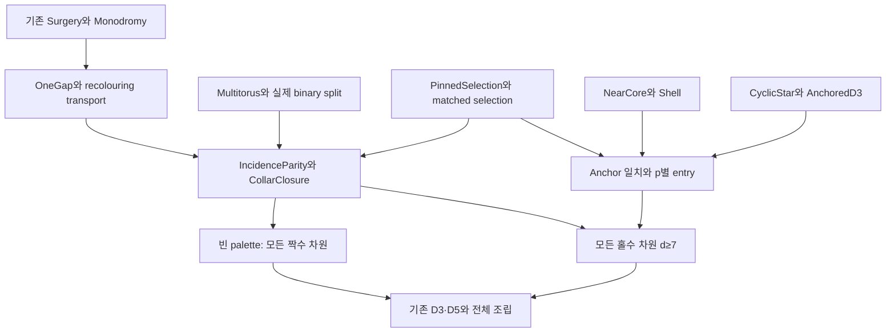

# 짝수 토러스 Lean 형식화 준비

2026-09-11. 조사 기준은 `even-modulus`의
`83064463d40a889ad30f1ce896a5ede1a5256fd9`이며, 조사 시작 시 작업 트리는 깨끗했다.

후속 구현은 E4·E5와 전체 법수 조립까지 완료되었다. 최신 결과와 검증은
[E5 완료 기록](E5_COMPLETION_20260911.md)을 따른다.
OneGap·상대 transport·physical split·incidence parity 보조정리가 추가되었다.
아래의 `Collar/` 및 CPU Lean 환경 부재, 첫 독립 목표 등의 문장은 **준비 시점의 기록**이다.

**다음 작업은 E4의 relative collar와 E5의 anchored entry다.** E0–E3를 다시
시작할 필요는 없다. 홀수 법수 전체 정리, 짝수 D3, 짝수 D5는 기존 결과를
재사용한다. 짝수 법수 전체 정리는 아직 `EvenOddDegreeGoal`을 가정한다.
이번 작업은 원고·소스 대조와 재현 확인이며 새로운 수학 정리를 추가하지 않았다.

## 목표와 현재 경계

입력은 [통합 원고](../../paper/torus_integrated_proof/even_directed_tori_integrated.tex)의
본문 §1–9 및 부록 A–B, `PROOF_STATUS_KO.md`, `formalization/INTERFACES.md`,
보존된 형식화 계획과 검사기다. 현재 통합본이 역사적 supplement보다 우선한다.
원고의 `thm:main`은 다음 문장이다.

```lean
∀ {d m : Nat}, 2 ≤ d → Even m → 4 ≤ m →
  Shared.CayleyHamiltonDecomposition d m
```

`Shared.TorusVertex d m = Fin d → ZMod m`이고,
`CayleyDecomposition`은 `colorDir`, 정점별 색→방향의 정확한 분할,
각 `x ↦ x + e_(colorDir c x)`의 `IsSingleCycleMap`을 갖는다.
후자는 전단사성과 모든 두 정점 사이의 iterate 도달성을 함께 요구한다.
따라서 목표는 양의 좌표 간선 전체의 Hamilton 분해를 표현한다.

현재 최상위 조립은 [Endpoints.lean](../TorusEven/Endpoints.lean)의
`even_modulus_tori_all_dimensions_of_collar`이며, 남은 입력은 정확히

```lean
TorusEven.EvenOddDegreeGoal
-- = ∀ {d m}, Odd d → 7 ≤ d → (Even m ∧ 4 ≤ m) →
--     Shared.CayleyHamiltonDecomposition d m
```

이다. `Goal : Prop`의 존재나 조건부 조립의 axiom 목록만으로 이 입력이 증명되지는
않는다. 반대로 `ChronologicalTransversalGoal`은 별도 파일에서 이미 증명되었으므로
이름이나 오래된 `proof pending` 주석으로 미완료 판정을 내리지 않는다.

## 원고와 기존 Lean의 대응

아래 K는 기존 증명 산출물의 타입·axiom 조회까지 확인한 결과다. 표준 axiom은
`propext`, `Classical.choice`, `Quot.sound`이다. 전체 소스의 새 빌드는 아니다.

| 원고 또는 역할 | 기존 Lean 위치·정리 | 현재 상태 |
|---|---|---|
| 실제 토러스와 Hamilton 분해 | [Shared/TorusCayley.lean](../Shared/TorusCayley.lean) | 공통 최종 타입 |
| `lem:lift`, unit carry | [Shared/Monodromy.lean](../Shared/Monodromy.lean), `single_cycle_of_skewProduct_zmod_additive_carry_of_rank_unit_sum` | 단일 base circuit에 재사용; 여러 circuit에는 각 orbit subtype으로 적용 |
| `lem:surgery` | [D5/FirstReturn.lean](../TorusEven/D5/FirstReturn.lean), `Surgery.orbitSet_comp_eq`, `retTime`, `ret` | 표시 orbit의 segment 분해 완료; 일반 return permutation과 unhit-cycle 계수식은 추가 연결 필요 |
| `lem:chronological` | [D5/Chronological.lean](../TorusEven/D5/Chronological.lean), `Chronological.chronological_transversal` | K, 표준 axiom만 |
| ordinary D3 | [D3.lean](../TorusEven/D3.lean), `d3_even` | K, native leaf 14개; 원고 `prop:anchor`의 witness는 아님 |
| `thm:d5large`, 짝수 m≥6 | [D5.lean](../TorusEven/D5.lean), `d5_even_large` | K, 표준 axiom만 |
| `thm:d5`의 m=4 경계 | [D5Four.lean](../TorusEven/D5Four.lean), `d5_even_four` | K, native leaf 4개; 원고 tour와 다른 Route-E witness |
| D2와 차원 곱 | [Dispatch.lean](../TorusEven/Dispatch.lean), `uniform_two`, `uniform_mul`, `uniform_two_pow` | 홀짝 무관 재사용 |
| `thm:pinned`, `thm:onegap`, `lem:inherit`, `thm:closure` | E4에 새로 필요 | `Collar/` 구현 없음 |
| near core·shell·cyclic-star·anchor·entry | E5에 새로 필요 | `Entry/` 구현 없음 |
| `thm:oddconstruction` | `EvenOddDegreeGoal` | 열려 있음 |
| `cor:all-moduli`의 홀수 입력 | [RoundComposite/V75Endpoints.lean](../RoundComposite/V75Endpoints.lean), `odd_modulus_tori_all_dimensions_v75` | K, native leaf 88개; 짝수 정리와 합칠 때만 필요 |

D5의 상세 경로는 `Chart → Schedule/Layers → Certificates/LatticeData/Lattice →
Stage/Preterminal/ReturnFull → Endpoint{,1,2}/Terminal{1,3,4} → D5`다.
정수 역행렬의 환원과 실제 chronological prefix 합동을 모두 사용한다.
일반 m에서 행렬식이 단지 0이 아니라는 조건을 가역성으로 바꾸면 안 된다.

현재 명시된 무조건부 차원에는 `2^k (k≥1)`, 3, 5, 6, 9, 10, 15가 있다.
`uniform_mul`을 반복하면 소인수가 2·3·5뿐인 모든 차원 d≥2를 도출할 수 있지만,
이를 한 번에 표현하는 일반 smooth-dimension 정리는 아직 없다.
곱의 입력은 `D_a(m)`와 **`D_b(m^a)`**다. 예를 들어 짝수 차원 14를 닫으려면
아직 열린 7차원 입력이 필요하다. E1만으로 모든 짝수 차원이 닫힌 것은 아니다.

## 다음 구현 순서와 증명 명세



1. **`Collar/Multitorus.lean`, `BinaryLift.lean`.**
   중간 객체는 `T_m(a₁,…,aₙ)`다. 양의 폭, `Σ aᵢ=d`, 색별 successor permutation,
   방향별 source quota를 보관한다. 최종 폭이 모두 1일 때 기존 `CayleyDecomposition`으로
   변환한다. 합좌표 equiv `(x,t) ↦ (…,xᵢ-t,t,…)`와 binary carry의 두 child quota를
   증명한다. 색별 전단사성은 sourcewise Latin 조건과 별도 의무다.

2. **`Collar/OneGap.lean`.**
   먼저 additive fibre에 대해 증명한다. 한 old circuit을 유한 타입 X로 제한하고,
   S가 그 위의 단일 순환, L=|X|, U가 비어 있지 않은 표시 집합이라고 하자.
   `OpenGap(S,U,u) = {S^[k] u | 0 < k ∧ k < retTime S U u}`로 잡는다.
   δ의 nonzero support가 지정 gap 안에 있고 `IsUnit (∑ x, δ x)`임을 입력받아
   lift `(x,t) ↦ (S x,t+δ x)`에 대해 다음을 함께 반환해야 한다.
   - 전체 lift가 단일 순환이다.
   - U×{0}에서 첫 귀환은 `(u,0) ↦ (ret S U u,0)`이다.
   - 귀환 시간은 보통 gap에서 그대로이고 지정 gap에서 `(m-1)L`만큼 증가한다.
   - 모든 nonzero fibre 점이 **새 지정 open gap**에 속한다.

   마지막 결론이 다음 귀납의 입력이다. unit total만으로는 표시점 순서가 보존되지
   않는다. 기존 `Surgery.seg`는 끝점을 포함하므로 open gap으로 그대로 쓰지 않는다.
   그 뒤 `S ∘ r` 방향으로 transport를 증명하며 U를 만나지 않는 old orbit도
   하나씩 lift됨을 별도로 보존한다. 패치 후 개별 cycle 길이가 모두 m배라는
   결론은 사용하지 않는다.

3. **`Collar/PinnedSelection.lean`.**
   유한 block B, 전체 circuit label Ω, support `A B : Finset Ω`,
   `|A B|≥2`, `b B=|A B|/2`, support당 active label≤1을 입력으로 둔다.
   **고립 열을 포함한** 각 incidence component의 열 수가 짝수라는 조건에서,
   `J B t ⊆ A B`, `|J B t|=b B`, 각 열 총수≡±1 (mod m), active의 row 0 배제를
   얻는다. 각 block의 selected row family와 complement family의 coherence를
   각각 증명한다. child 폭 1에는 coherence를 요구하지 않는다.

   증명 순서는 forest parity join → block별 disjoint pairing → divergence 방향화
   → filler 부등식 → rows 0/1/2 배치다. pairing 결과의 평행 간선을 잃지 않도록
   간선 ID와 두 endpoint를 보관한다. 고정 mathlib의 `SimpleGraph/Trails.lean`은
   Euler trail 존재의 역방향을 TODO로 남겨 두므로 이를 기성 정리로 가정하지 않는다.
   matched entry에도 재사용하려면 지정 odd-degree 열에서 ±1, 나머지에서 0인
   방향화 형태가 유용하다. 이는 새로 증명할 보조정리다.

4. **`Collar/IncidenceParity.lean`, `Closure.lean`.**
   circuit label은 색만이 아니라 `(색, 실제 orbit)`이다. collar state에는 현재
   fibre chart, fibre별 방향·orbit 일치, 방향당 active user≤1, zero-section 표시,
   orbit별 gap 조건, 모든 비종결 방향의 성분별 parity를 포함한다.
   새 block은 old source 하나 위의 fibre이며 column degree에 m을 다시 곱하지 않는다.
   coherence와 `a'·#blocks = Σ columnDegree`로 child parity를 재생하고,
   untouched 방향의 column-component partition도 유지한다.
   균형 분할 후 `Σ(aᵢ-1)=d-n`이 정확히 1 감소함을 증명한다.
   다음 좋은 분할이나 solver 성공을 추가 가정으로 받지 않는 closure가 수락 기준이다.

5. **`Entry/NearCore.lean`, `Shell.lean`, `CyclicStar.lean`, `AnchoredD3.lean`.**
   near core의 cycle 수 `(1,1,2)`와 두 defect orbit의 parity label을 실제 방향표에서
   증명한다. 이는 방향 multiplicity `(1,1,1)`와 구분한다. shell을 더한 seed의 폭은
   `(p-⌊p/2⌋+1,⌊p/2⌋+1,p+1)`이고, circuit 열 수는 `2p+4=d+1`이다.
   terminal core는 부록 A의 `3∤m`/`3∣m` 귀환 계산 및 m=4,6 경계를 형식화한다.
   그 witness가 다음 네 점에서 near core와 같은 방향을 쓰는지 증명한다.

   `Q_m = {(0,1,0), (1,1,0), (0,0,0), (0,m-2,3)}`.

   ordinary D3 존재 정리는 이 일치를 제공하지 않는다. 패치 U_m을 실제 변경 source
   집합으로 정의하여 `Q_m ∩ U_m = ∅`를 얻는다.

6. **`Entry/Small.lean`, `Entry/Matched.lean`, 전체 조립.**
   p=2는 mates `(B0,B1,A0,A1)`와 폭 1 선택을 사용한다. p=3은
   **`(A1,B0,A0,A2)`** 및 `(h,w)=(0,1)`의 추가 B1/B2 block을 사용한다.
   p≥4의 일반 mate 표를 p=3에 적용하지 않는다. 각 active orbit의 carry가 실제로
   한 번이고 Q_m에서만 생김을 증명하여 첫 collar를 만든다. 네 좌표에서 시작해
   d−4번 closure를 적용하면 `EvenOddDegreeGoal`이 닫힌다. 최종 패치는 매 split의
   zero section에 한 번만 넣는다. 이후 기존 `_of_collar`에 이 정리를 전달한다.

첫 독립 목표는 **additive OneGap의 귀환 시간과 renewal까지 증명하는 것**이다.
PinnedSelection은 그 다음 일반 엔진이며, E4의 첫 전체 결과는 빈 active palette를
통한 모든 짝수 차원 정리로 삼는다. 전체 귀납이 닫힌 뒤 support-size/type-count
따름정리와 permutation-valued fibre 일반화를 진행한다.

## 재현 확인과 신뢰 범위

원시 출력은 `evidence/lean_audit_20260911/preparation/`에
보존했다. toolchain은 기존 [EVEN_LOCK.md](EVEN_LOCK.md)와 일치한다:
Lean `v4.30.0-rc2`, mathlib `5450b53e5ddc75d46418fabb605edbf36bd0beb6`.

- 원본 zip SHA256: `29f11797cfab9c68f7f33dcca2d5458f4f976f4bbb2fd600a7e3347c47214885`.
- 통합 TeX SHA256: `846a1e5f0a4ab5ea3511b312a3a8230210dc10e27f1483d1700445a670188e98`.
- 추출한 35개 manifest 항목의 byte 수와 SHA256 모두 일치했다.
- 유지 소스의 기존 `.olean`을 import하여 endpoint 타입과 axiom을 조회했다.
  [EndpointAudit.lean](../evidence/lean_audit_20260911/preparation/EndpointAudit.lean),
  [출력](../evidence/lean_audit_20260911/preparation/endpoint-audit.log),
  [집계](../evidence/lean_audit_20260911/preparation/axiom-counts.json)를 보존했다.
  D3의 native 의존은 **14개**, D5(4)는 **4개**, 조건부 even endpoint는 **18개**다.
  기존 ledger의 16/20개 표기를 수정했다. D5(m≥6)와 chronological theorem은 표준
  axiom만 사용하며, odd endpoint는 기존 88개다.
- `python3 scripts/check_even_isolation.py` 통과: main-path 파일 29개,
  attic 파일 4개, 등록 native 사용 파일 3개. 등록 **파일 수**와 axiom 수는 다르다.
- 별도의 CPU 노드에서 다음 기존 검사기를 실행했다.
  세 결과 모두 번들 리포트와 바이트 단위로 일치했다.

| 검사 | 이번 재실행 범위 |
|---|---|
| `verify_tour_certificate.py` | D5(4) 정점 1024개·양의 간선 5120개, 손상 증서 4종 거부 |
| `check_transversal_lemma.py` | 비선형 prefix 100개, quotient 가정을 뺀 실패 대조 |
| `check_core_manuscript.py` | core 법수 19개, shell 12개, incidence 174개, 부록 귀환 99개 |

재실행 로그는 `evidence/lean_audit_20260911/preparation/checks/`에 있다. dense small-entry와 전체 D5
integration은 이번에 다시 실행하지 않았다. 번들의 기존 E/C 증거이며 일반 정리의 K가
아니다. 원고 m=4 tour의 Lean checker soundness도 아직 별도 작업이다. 현재 전체
존재 정리 경로에는 이미 증명된 다른 D5(4) witness를 사용할 수 있다.

현재 모듈 구성을 바꾸지 않고 재조회하는 명령은 다음과 같다.

```bash
cd <repository root>
lake env lean evidence/lean_audit_20260911/preparation/EndpointAudit.lean
python3 scripts/check_even_isolation.py
```

새 증명이 생겼을 때의 수락은 빌드 checkout에서 해당 모듈의 `lake build`, 이어
`lake build TorusEven`과 최상위 `#print axioms`로 한다. 기본 Lake target에는 odd V75
endpoint가 없으므로, 홀수 경로도 건드렸다면 `lake build RoundComposite.V75Endpoints`를
명시해야 한다. 이번 문서 변경을 전체 Lean 재빌드로 보고하지 않는다.
