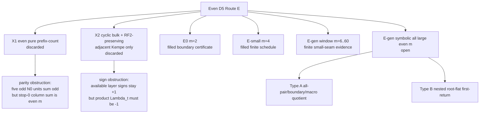

# Route E Latest Commit Visualization

Date: 2026-05-06.

Scope: snapshot of local `route-e-v3-6-20260506` through `1112f21`, compared with
`origin/route-e-v3-6-20260506` at `6ab7e51`.

At that snapshot the local branch was 96 commits ahead of origin.  Those commits add 91 files and
54,508 inserted lines, almost entirely as scripts, certificates, and audit
documents for the corrected even `D_5` Route E branch.

## High-Level Flow


## Latest Commit Bands

| time UTC | commit band | mathematical movement | artifact status |
| --- | --- | --- | --- |
| 16:39-18:40 | `86887b0`..`f6dcfa6` | Route E criteria, ansatz failure, sign obstruction, corrected dispatcher | branch taxonomy corrected |
| 18:48-19:09 | `c75debc`..`5a91a94` | finite window, B20 extension, B16/R14e package evidence | proof-facing Type-A evidence preserved |
| 19:16-19:52 | `a3bc306`..`d1d6987` | Type-A symbolic skeleton, residue coverage, Lambda_E mask polynomials | symbolic artifacts verified locally |
| 19:54-20:04 | `5b7d8c3`..`b32434a` | open-residue smoke screen, portfolio coverage and affine fits | R42 identified as next simple candidate |
| 20:06-20:31 | `1538fa5`..`b6af22c` | R42 affine record, q=0..4 verification, boundary quotient fits, q=1 block table, no-go audit | R42 sample-verified but still open |
| 20:31-20:38 | `8ea8eea`..`0cd8204` | R42 detailed block-signature caveat and ledger refresh | promotion target sharpened, still open |
| 20:40-20:50 | `a700cc9`..`a72d8d4` | R42 q>=2 tail fits, transition/block mass symbolics, regenerated block-formula verification | stronger R42 evidence, still open |
| 20:50-21:05 | `10e8561`..`f7b0506` | R42 interval-count tails promoted into compact summary | remaining compact block debt reduced to q=1 boundary exception |
| 21:05-21:15 | `5899423`..`b36ec5f` | R42 all-pair time polynomial fits and symbolic fit-sum verifier | time-exhaustion evidence strengthened, still open |
| 21:15-21:25 | `f026400` | R42 all-pair transition count/time polynomial matrices | transition support evidence strengthened, still open |
| 21:25-21:35 | `64ffb3a` | R42 promotion audit separates evidence from theorem blockers | exact remaining R42 blockers recorded |
| 21:35-21:45 | `323bbbe`..`42041aa` | ledger refresh and open-residue promotion queue | R42/R38/portfolio-only queue recorded |
| 21:45-22:00 | `5ba4770` | R42 pointwise law-mining diagnostic | naive pointwise law complexity recorded |
| 22:00-22:10 | `1112f21` | R42 residue-class pointwise diagnostic | simple residue-affine trace law ruled out for nontrivial labels |

## Proof Progress Gauge

The machine audit still reports 2 missing structural items.

```text
Artifacts/audits:  [####################################--] 36/38
Closed theorem:    [---------------------------] incomplete
```

The two missing items are structural, not clerical:

| open item | current blocker |
| --- | --- |
| Type-A residue coverage complete | proof-facing residues are only `14,16,20,40,44 mod 48` |
| E-gen-symbolic branch closed | no uniform all-even full layered parity-changing template yet |

## Corrected Branch Taxonomy



## Residue Coverage Mod 48

Legend: `P` means proof-facing Type-A branch evidence, `C` means current
symbolic-promotion candidate, `G` means gate-transducer target, `O` means still
open.  The all-pair portfolio has samples for all 24 even residues, but samples
are kept separate from proof-facing branch theorems.

| residue | 0 | 2 | 4 | 6 | 8 | 10 | 12 | 14 | 16 | 18 | 20 | 22 |
| --- | --- | --- | --- | --- | --- | --- | --- | --- | --- | --- | --- | --- |
| status | O | O | O | O | O | O | O | P | P | O | P | O |

| residue | 24 | 26 | 28 | 30 | 32 | 34 | 36 | 38 | 40 | 42 | 44 | 46 |
| --- | --- | --- | --- | --- | --- | --- | --- | --- | --- | --- | --- | --- |
| status | O | O | O | O | O | O | O | G | P | C | P | O |

The open-residue promotion queue records the same split machine-readably:

```text
proof_facing: [14,16,20,40,44]
active_promotion_target: [42]
gate_transducer_target: [38]
portfolio_only_symmetric_nonaffine: [0,2,4,6,8,10,18,22,24,26,28,30,32,34,46]
portfolio_only_nonaffine: [12,36]
```

## R42 Discovery Snapshot

Observed family:

```text
m = 48q + 42
x = z = 6q + 5
all-pair nodes = 480q + 411
boundary nodes = 3m - 2 = 144q + 124
```

Sample verification by `scripts/routeE_allpair_cpp_v1_2.cpp`:

| q | m | x=z | all-pair nodes | top cycle length | time identity |
| --- | ---: | ---: | ---: | ---: | --- |
| 0 | 42 | 5 | 411 | 411 | `sum tau = m^4` |
| 1 | 90 | 11 | 891 | 891 | `sum tau = m^4` |
| 2 | 138 | 17 | 1371 | 1371 | `sum tau = m^4` |
| 3 | 186 | 23 | 1851 | 1851 | `sum tau = m^4` |
| 4 | 234 | 29 | 2331 | 2331 | `sum tau = m^4` |

For `q >= 1`, the boundary quotient stabilizes as one boundary cycle with 29
blocks:

| label | block count |
| --- | ---: |
| `Z` | 1 |
| `03` | 7 |
| `04` | 13 |
| `34` | 8 |

Transition-count fits for `q >= 1`:

| src \ dst | `Z` | `03` | `04` | `34` |
| --- | ---: | ---: | ---: | ---: |
| `Z` | 0 | 1 | 0 | 0 |
| `03` | 0 | 1 | `30q + 25` | `18q + 15` |
| `04` | 1 | `30q + 24` | 0 | `18q + 16` |
| `34` | 0 | `18q + 15` | `18q + 16` | `12q + 10` |

Recent commits add the representative `q=1` boundary block table and record that
the current miner does not yet fully compress all condition-interval metadata.
Later commits add q>=2 tail formulas for the q=1 boundary exception and verify
the transition/block mass formulas symbolically.  A regeneration checker now
rebuilds temporary R42 finite witnesses for `q=1,2,3,4,5,6` and confirms that the
stored 29 block formulas still match the fresh block tables.  The multi-sample
open interval-count fields have been promoted into q>=N tail formulas, and the
compact summary now preserves the unique `Z>13` boundary path directly.  The R42
boundary quotient is now a stronger compact symbolic-promotion map, but it is
still not a proof of the R42 residue.

The all-pair time artifact additionally fits the sample return-time total as

```text
3111696 + 14224896q + 24385536q^2 + 18579456q^3 + 5308416q^4 = (48q+42)^4.
```

It also records source/destination label count and time-total fits.
The verifier checks that source/destination count fits sum to `480q+411`, and
source/destination time fits sum to `(48q+42)^4`.
The all-pair transition artifact records a 28-edge nonzero transition support
on the 11 section labels; the count/time transition matrices verify against
q=0..6 samples and have strongly connected support.

## Mathematical Findings

1. Even pure prefix-count cannot work.  In even modulus every unit is odd, so
   the five required `N_0` unit entries have odd total, while the Latin stop-0
   column balance requires total `m`, which is even.
2. RF2-preserving adjacent-Kempe repairs from cyclic bulk cannot work by
   themselves.  Their layer sign stays `+1`, but even `D_5` requires
   `product_t Lambda_t = -1` because five single-cycle return maps each have
   sign `-1`.
3. `Lambda_E` local mask counts have been promoted from finite observations to
   symbolic polynomials and verified by recomputation: 32 masks, 27 reachable,
   5 unreachable.
4. Type-A proof-facing evidence now covers residues `14,16,20,40,44 mod 48`
   via B20/B16/R14e artifacts, but this is only 5 of 24 even residue classes.
5. The all-pair portfolio covers all 24 even residue classes by samples and
   identifies R42 as the only new simple affine `x=z` candidate outside the
   already proof-facing residues.
6. R38 remains an open gate-transducer target.  The symmetric probes are useful
   negative controls, not a closed branch law.
7. R42 was the sharpest affine promotion candidate: samples verify for `q=0..4`,
   the `q>=1` boundary quotient has a stable 29-block profile, transition/block
   mass identities verify symbolically, the 29 block formulas match fresh
   regenerated witnesses for `q=1..6`, and the optional open interval-count
   metadata is stored as tail formulas in the compact summary.  The later
   clock-carry audit demotes this specific c-band threshold/residue promotion
   path.
8. R42 all-pair time evidence now has a compact polynomial artifact: the total
   return-time fit is exactly `(48q+42)^4`, with label-wise count/time fits
   verified against q=0..6 samples.
9. R42 all-pair transition evidence is compacted into polynomial matrices with
   28 nonzero support edges, verified row/column sums, and strongly connected
   count/time support.
10. R42 boundary expansion is verified: the 29 boundary blocks expand directly
    to the all-pair source-label counts for q=1..6, with the unique `Z>13`
    boundary path preserved in the compact summary.
11. R42 boundary block-transducer evidence is now explicit: q>=2 has stable
    strongly connected 69-edge support on the 29 boundary blocks.  Edge counts
    are not all affine in q, but they are piecewise rational-affine by q mod 2.
12. R42 now has an explicit mod-96 promotion split: finite cases `m=42,90`,
    then generic subbranches `m=96s+42` and `m=96s+90`.
13. On those two mod-96 subbranches, all 69 block-edge count laws become
    ordinary affine functions of `s`.
14. The finite boundary cases created by that split, `m=42` and `m=90`, are
    explicitly recorded from the all-pair checker and color-sign screen.
15. R42 promotion readiness is explicitly audited.  It is not promotion-ready:
    pointwise first-return equations, no-early/minimality, and a Lean-facing
    endpoint theorem are still missing.
16. R42 pointwise law mining now quantifies the missing trace grammar: the
    naive source-label/source-parameter interval-affine partition reaches
    1492 blocks by `q=4`, and no nontrivial label has a common passing
    residue-affine modulus among `2,3,4,5,6,8,10,12,16,24,32,48`.
    A global section-index affine partition is smaller but still reaches 1051
    blocks by `q=4`, so aggregate transition/time fits are still not enough.
17. R42 mod-96 edge partitions are now preserved as a verified diagnostic.
    On both generic subbranches, the 69 boundary-block edges have
    affine-in-`s` source-condition count/bound data, and the `qsteps`
    coefficient laws are affine in `s`.  The same artifact records why this is
    still not a theorem: target maps and `qtime` maps remain incomplete, so it
    does not close pointwise first-return or no-early.
18. The R42 tail-refinement diagnostic localizes that incompleteness.  After
    dropping the first generic sample in each parity branch, target coefficient
    laws become affine in `s`; after dropping the first two generic samples,
    `qtime` non-affine-in-`s` cases disappear, leaving exactly 22 qtime-missing
    edges on each branch.
19. R42 qtime interval profiles show that the remaining 22 qtime-missing edge
    groups are not arbitrary.  On q=6,7,8,9, each such edge becomes qtime-affine
    after splitting by contiguous source-`a` intervals.  The next R42 grammar
    target is therefore an interval-level qtime table.
20. The interval table is now smaller than it first looked: all interval-count
    and member-count laws are affine in the branch parameter, and the only
    multi-point interval edge is `25 -> 3`; the other 21 qtime-missing edges are
    singleton-interval families.
21. A simple start/end ordinal grammar for those intervals has been tested and
    rejected.  It leaves 2266 repeated non-affine ordinal groups and 2758
    uncovered interval occurrences on q=6..11, so the next qtime law must use a
    richer interval key.
22. R42 has now been reparametrized by `c=6q+5`, so `m=8c+2` and `x=z=c`.
    In this coordinate the boundary skeleton has transition masses
    `5c,3c,2c`:

    ```text
    03 -> 04 = 5c,      03 -> 34 = 3c
    04 -> 03 = 5c - 1,  04 -> 34 = 3c + 1,  04 -> Z = 1
    34 -> 03 = 3c,      34 -> 04 = 3c + 1,  34 -> 34 = 2c
    ```

    The verifier also records `c^{-1}=4c-3` and `(6c+1)^{-1}=4c-1`
    modulo `m=8c+2`.  This supports the new interpretation that the
    29-block/69-edge quotient is a projection of a finer c-band clock-carry
    transducer.
23. The unique multi-point qtime edge `25 -> 3` now has a focused
    clock-carry diagnostic on q=6,7,8,9.  Its support is exactly

    ```text
    [1+3n, 2+3n], 0 <= n <= (2c-4)/3
    {2c+1+6j},    0 <= j <= (c-2)/3
    {2c+3+6j},    0 <= j <= (c-5)/3
    {4c}
    ```

    Thus `member_count=2c`, `interval_count=(4c+1)/3=m/6`, and the qtime
    slope alphabet is `0,4c+3,12c+5` on the sampled witnesses.  The verifier
    also checks the corresponding qtime coefficient formulas, including the
    carry at odd `n >= (c+1)/3`.  This is positive evidence for a carry grammar,
    not a proof of the remaining 21 qtime edges or no-early.
24. A support-level c-band atom scan now covers all 22 qtime-missing edges.
    Splitting by edge, interval length, c-band, and `u mod 6` gives 116 support
    atoms on each parity branch.  On q=6,7,8,9 every atom has affine count and
    affine `j`-range endpoints in the branch parameter `s`.  This supports a
    finite clock-carry state set, but qtime coefficients and no-early remain
    open.
25. A first qtime atom model has now been tested on the same 116 atoms per
    parity branch.  All qtime slopes are affine in the branch parameter, but
    the first intercept model

    ```text
    A + B*s + C*s^2 + D*j + E*s*j
    ```

    fails on exactly 9 atoms in each parity branch.  This is useful negative
    evidence: `edge + interval length + c-band + u mod 6` is enough for support
    and slopes, but one more carry/winner split is needed for qtime intercepts.
26. The next bad-intercept carry split has been mined on parity-separated
    samples.  On q=6,8 and q=7,9, the 9 bad atoms in each parity branch split
    into 8 one-threshold carry atoms and 1 two-residue carry atom.  The unique
    two-residue atom is `20->26|L1|B7:7|R0:0`, using the sampled features
    `m*1[j%5=0]` and `m*1[j%6=5]`.  This identifies the next finite state
    refinement, but it is still sampled qtime evidence rather than a no-early
    proof.
27. The larger stress test q=6,8,10 and q=7,9,11 refutes the simple one-step
    bad-intercept split as a stable law.  In each parity branch only 7 atoms
    remain one-feature, 1 remains two-feature, and
    `20->26|L1|B7:7|R0:0` is unresolved by the tested one/two-feature family.
    This is negative evidence against promoting that split; R42 needs a deeper
    clock-carry state or a different primitive description.
28. The unresolved atom `20->26|L1|B7:7|R0:0` was probed directly.  On
    q=6,8,10 it is rescued by a depth-three model using a threshold carry and
    the two residue carries `j%5=0`, `j%6=5`; on q=7,9,11 it is not rescued by
    any tested feature set through depth three.  This parity asymmetry is the
    current strongest warning against the simple c-band clock-carry promotion.
29. The open residue queue is now explicit: R42 is demoted unless a new raw
    zero-clock winner/carry state is introduced, R38 remains the gate-transducer
    target, and the remaining 17 open residues are portfolio-only law-mining
    targets.

## Remaining Proof Route

```mermaid
flowchart LR
  R42C[R42 candidate data]
  Law[closed packet/count law<br/>all q >= 0]
  RF[RF1/RF2 or all-pair adapter proof]
  Sign[product Lambda_t = -1]
  Return[first-return equations]
  Min[no-early/minimality]
  Cycle[quotient/splice one-cycle]
  Time[sum tau = m^4]
  Lean[Lean-facing theorem endpoint]
  Cover[combine with residue cover]
  Theorem[all-even Route E theorem]

  R42C --> Law --> RF --> Sign --> Return --> Min --> Cycle --> Time --> Lean --> Cover --> Theorem
```



The branch should still be treated as an evidence-rich open proof program:
many certificates are green, but the generic symbolic theorem is not closed.
